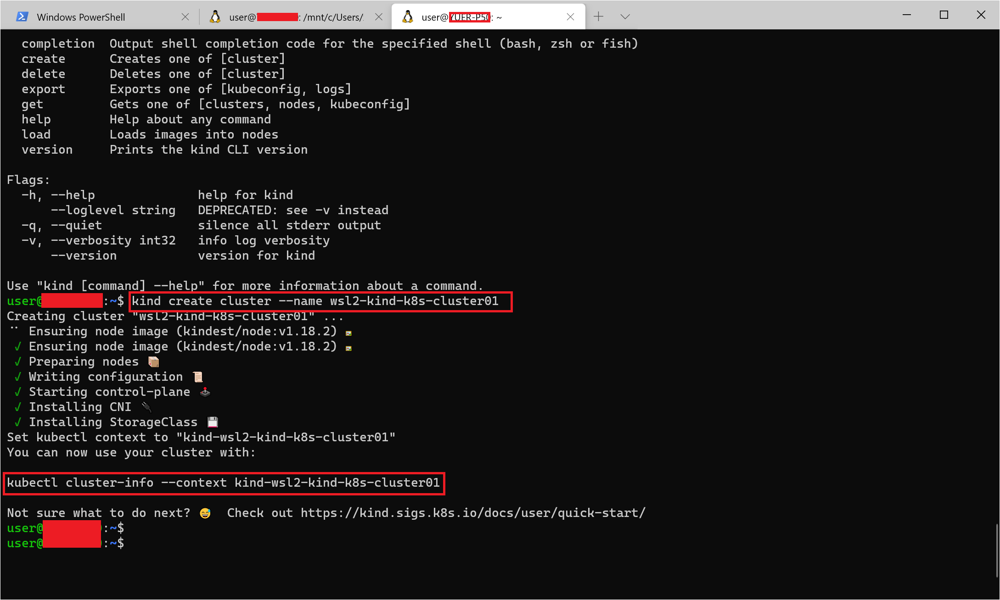

# https://kubernetes.io/blog/2020/05/21/wsl-docker-kubernetes-on-the-windows-desktop/

```
# Update the repositories and list of the packages available
sudo apt update
```

```
# Update the system based on the packages installed > the "-y" will approve the change automatically

sudo list --upgradeable

sudo apt upgrade -y
```

```
# Try to see if the docker cli and daemon are installed
docker version
```

```
# Try to see if the docker cli and daemon are installed
docker version
```

```
# Same for kubectl
kubectl version
```

# 比Minikube更快，使用Kind快速创建K8S学习环境
# KinD: Kubernetes made easy in a container

https://kind.sigs.k8s.io/docs/user/local-registry/

https://kubernetes.io/docs/concepts/containers/images/#using-a-private-registry

https://kind.sigs.k8s.io/docs/user/private-registries/

https://kind.sigs.k8s.io/docs/user/using-wsl2/

https://kind.sigs.k8s.io/docs/user/working-offline/


```
# echo Linux
echo $(uname)
```

```
# Download the latest version of KinD
# curl -Lo ./kind https://github.com/kubernetes-sigs/kind/releases/download/v0.7.0/kind-$(uname)-amd64
cd ~
curl -Lo ./kind https://github.com/kubernetes-sigs/kind/releases/download/v0.8.1/kind-$(uname)-amd64
```

```
# Make the binary executable
chmod +x ./kind
```

```
# Move the binary to your executable path
sudo mv ./kind /usr/local/bin/
```

# KinD: the first cluster

We are ready to create our first cluster:

```
# Check if the KUBECONFIG is not set
echo $KUBECONFIG
```

```
# Check if the .kube directory is created > if not, no need to create it
ls $HOME/.kube
```

```
# Create the cluster and give it a name (optional)
# kind create cluster --name wslkind
kind create cluster --name wsl2-kind-k8s-cluster01
```




```
# Check if the .kube has been created and populated with files
ls $HOME/.kube
```


# KinD: counting 1 - 2 - 3

Our first cluster was created and it's the "normal" one/single node cluster:

```
# Check how many nodes it created
kubectl get nodes
```

```
# Check the services for the whole cluster
kubectl get all --all-namespaces
```


# KinD: can I see a nice dashboard?

Working on the command line is always good and very insightful. However, when dealing with Kubernetes we might want, at some point, to have a visual overview.

For that, the Kubernetes Dashboard project has been created. The installation and first connection test is quite fast, so let's do it:


https://github.com/kubernetes/dashboard/releases/tag/v2.0.3

```
# Install the Dashboard application into our cluster
# kubectl apply -f https://raw.githubusercontent.com/kubernetes/dashboard/v2.0.0-rc6/aio/deploy/recommended.yaml
kubectl apply -f https://raw.githubusercontent.com/kubernetes/dashboard/v2.0.3/aio/deploy/recommended.yaml
```

```
# Check the resources it created based on the new namespace created
kubectl get all -n kubernetes-dashboard
```
